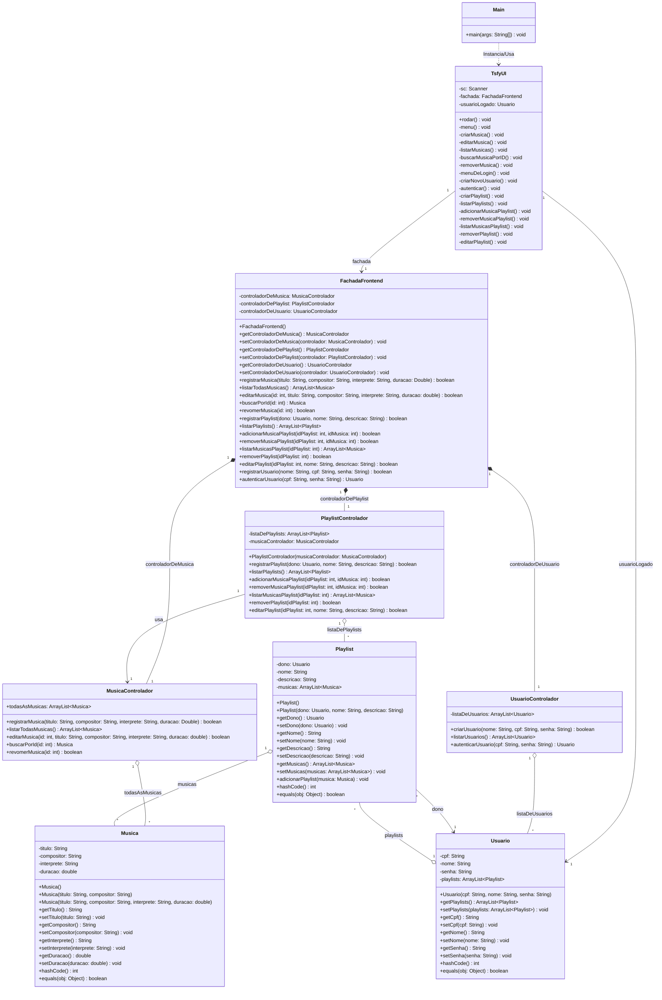

# Diagrama de Classes do Tsfy (UML)

```mermaid
classDiagram
    class Main {
        +main(args: String[]) void
    }

    class TsfyUI {
        -sc: Scanner
        -fachada: FachadaFrontend
        -usuarioLogado: Usuario
        +rodar() void
        -menu() void
        -criarMusica() void
        -editarMusica() void
        -listarMusicas() void
        -buscarMusicaPorID() void
        -removerMusica() void
        -menuDeLogin() void
        -criarNovoUsuario() void
        -autenticar() void
        -criarPlaylist() void
        -listarPlaylists() void
        -adicionarMusicaPlaylist() void
        -removerMusicaPlaylist() void
        -listarMusicasPlaylist() void
        -removerPlaylist() void
        -editarPlaylist() void
    }

    class FachadaFrontend {
        -controladorDeMusica: MusicaControlador
        -controladorDePlaylist: PlaylistControlador
        -controladorDeUsuario: UsuarioControlador
        +FachadaFrontend()
        +getControladorDeMusica() MusicaControlador
        +setControladorDeMusica(controlador: MusicaControlador) void
        +getControladorDePlaylist() PlaylistControlador
        +setControladorDePlaylist(controlador: PlaylistControlador) void
        +getControladorDeUsuario() UsuarioControlador
        +setControladorDeUsuario(controlador: UsuarioControlador) void
        +registrarMusica(titulo: String, compositor: String, interprete: String, duracao: Double) boolean
        +listarTodasMusicas() ArrayList~Musica~
        +editarMusica(id: int, titulo: String, compositor: String, interprete: String, duracao: double) boolean
        +buscarPorId(id: int) Musica
        +revomerMusica(id: int) boolean
        +registrarPlaylist(dono: Usuario, nome: String, descricao: String) boolean
        +listarPlaylists() ArrayList~Playlist~
        +adicionarMusicaPlaylist(idPlaylist: int, idMusica: int) boolean
        +removerMusicaPlaylist(idPlaylist: int, idMusica: int) boolean
        +listarMusicasPlaylist(idPlaylist: int) ArrayList~Musica~
        +removerPlaylist(idPlaylist: int) boolean
        +editarPlaylist(idPlaylist: int, nome: String, descricao: String) boolean
        +registrarUsuario(nome: String, cpf: String, senha: String) boolean
        +autenticarUsuario(cpf: String, senha: String) Usuario
    }

    class Musica {
        -titulo: String
        -compositor: String
        -interprete: String
        -duracao: double
        +Musica()
        +Musica(titulo: String, compositor: String)
        +Musica(titulo: String, compositor: String, interprete: String, duracao: double)
        +getTitulo() String
        +setTitulo(titulo: String) void
        +getCompositor() String
        +setCompositor(compositor: String) void
        +getInterprete() String
        +setInterprete(interprete: String) void
        +getDuracao() double
        +setDuracao(duracao: double) void
        +hashCode() int
        +equals(obj: Object) boolean
    }

    class Playlist {
        -dono: Usuario
        -nome: String
        -descricao: String
        -musicas: ArrayList~Musica~
        +Playlist()
        +Playlist(dono: Usuario, nome: String, descricao: String)
        +getDono() Usuario
        +setDono(dono: Usuario) void
        +getNome() String
        +setNome(nome: String) void
        +getDescricao() String
        +setDescricao(descricao: String) void
        +getMusicas() ArrayList~Musica~
        +setMusicas(musicas: ArrayList~Musica~) void
        +adicionarPlaylist(musica: Musica) void
        +hashCode() int
        +equals(obj: Object) boolean
    }

    class Usuario {
        -cpf: String
        -nome: String
        -senha: String
        -playlists: ArrayList~Playlist~
        +Usuario(cpf: String, nome: String, senha: String)
        +getPlaylists() ArrayList~Playlist~
        +setPlaylists(playlists: ArrayList~Playlist~) void
        +getCpf() String
        +setCpf(cpf: String) void
        +getNome() String
        +setNome(nome: String) void
        +getSenha() String
        +setSenha(senha: String) void
        +hashCode() int
        +equals(obj: Object) boolean
    }

    class MusicaControlador {
        +todasAsMusicas: ArrayList~Musica~
        +registrarMusica(titulo: String, compositor: String, interprete: String, duracao: Double) boolean
        +listarTodasMusicas() ArrayList~Musica~
        +editarMusica(id: int, titulo: String, compositor: String, interprete: String, duracao: double) boolean
        +buscarPorId(id: int) Musica
        +revomerMusica(id: int) boolean
    }

    class PlaylistControlador {
        -listaDePlaylists: ArrayList~Playlist~
        -musicaControlador: MusicaControlador
        +PlaylistControlador(musicaControlador: MusicaControlador)
        +registrarPlaylist(dono: Usuario, nome: String, descricao: String) boolean
        +listarPlaylists() ArrayList~Playlist~
        +adicionarMusicaPlaylist(idPlaylist: int, idMusica: int) boolean
        +removerMusicaPlaylist(idPlaylist: int, idMusica: int) boolean
        +listarMusicasPlaylist(idPlaylist: int) ArrayList~Musica~
        +removerPlaylist(idPlaylist: int) boolean
        +editarPlaylist(idPlaylist: int, nome: String, descricao: String) boolean
    }

    class UsuarioControlador {
        -listaDeUsuarios: ArrayList~Usuario~
        +criarUsuario(nome: String, cpf: String, senha: String) boolean
        +listarUsuarios() ArrayList~Usuario~
        +autenticarUsuario(cpf: String, senha: String) Usuario
    }

    %% Relacionamentos
    Main ..> TsfyUI : Instancia/Usa
    
    TsfyUI "1" --> "1" FachadaFrontend : fachada
    TsfyUI "1" --> "1" Usuario : usuarioLogado

    FachadaFrontend "1" *-- "1" MusicaControlador : controladorDeMusica
    FachadaFrontend "1" *-- "1" PlaylistControlador : controladorDePlaylist
    FachadaFrontend "1" *-- "1" UsuarioControlador : controladorDeUsuario

    MusicaControlador "1" o-- "*" Musica : todasAsMusicas
    
    PlaylistControlador "1" o-- "*" Playlist : listaDePlaylists
    PlaylistControlador "1" --> "1" MusicaControlador : usa

    UsuarioControlador "1" o-- "*" Usuario : listaDeUsuarios

    Playlist "*" --> "1" Usuario : dono
    Playlist "1" o-- "*" Musica : musicas

    Usuario "1" o-- "*" Playlist : playlists
```
